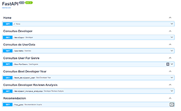
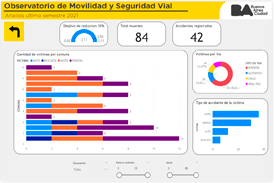

<h1> Hola, Soy Marcelo Yuba 👋 </h1>

### Un Data Analyst  y Data Scientist de Buenos Aires, Argentina

## Como contactarme

## Mi Stack tecnologico

## Muestra de trabajos

### Proyecto individual 1

<h4 style="display: flex; align-items: center;">
    
    Link al repositorio
</h4>

<h4 style="display: flex; align-items: center;">
     
Link al deploy
</h4>

### Proyecto individual 2

        
<h4> Link al repositorio</h4>
